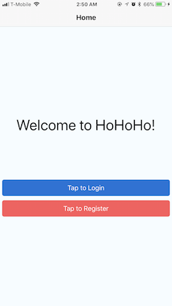
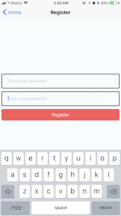
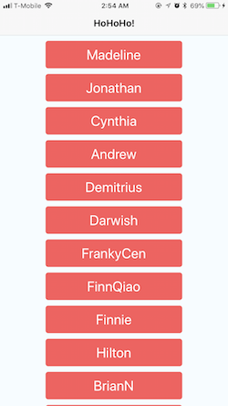
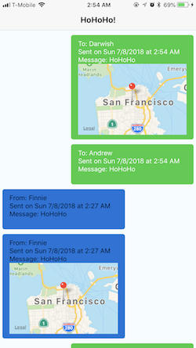

# Ho! Ho! Ho!

## Features:

- Register & Login
- Homepage: list all users
- Send a HoHoHo to another user
- List messages sent and received
- Pull to refresh

## Instructions

If you haven't already, make sure you install the Expo XDE from https://expo.io/tools
After you've opened the project in Expo XDE, you can load the app on your phone by
clicking the `Share` button, scan the QR code with your phone's camera or enter your phone number to receive a link to open the app on your phone!

The backend is already hosted and provided at https://hohoho-backend.herokuapp.com/

## Setup

1. Run npm install
2. Open the HoHoHo folder in Expo XDE and wait for it to finish opening
    - Project > open Project > Select the HoHoHo folder
5. Try launching the app on your phone now to make sure it works

**Note:** If you are having **connection issues**... (in order)
  - Make sure you don't have duplicate apps open in the background of your phone
  - Move on and try again in a couple minutes \- this usually does work, be patient
  - Try publishing and then normally connecting again
  - Press restart and/or restarting expo itself

## Part 1. Registration & Login

  

## Part 2. User list

**Tap on a user to send a message** / **Tap & hold to send your location**

 

## Part 3. Messages list

